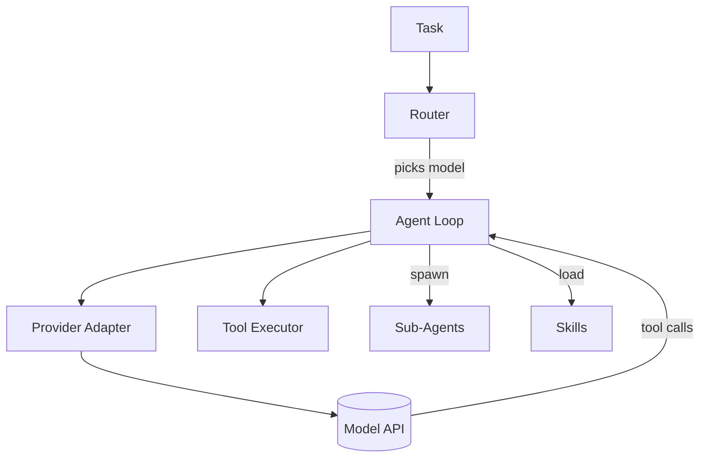

# arccode

A multi-provider agent harness, as a CLI. arccode routes each task to the right
model based on **complexity, cost, performance, and intent**, and can **spawn
specialist agents, load/import skills, and build new agents and skills** at
runtime.

Inspired by the architectures of Claude Code (file-based agents + skills),
jcode (model routing + swarm), and openclaw (clean provider/tool abstraction).



## Features

- **Multi-provider**: Anthropic, OpenAI, Ollama (local), OpenRouter behind one
  normalized interface. Models are hot-swappable.
- **Smart routing**: heuristic classifier scores each model by capability, cost,
  and latency for the task's intent and complexity. Explicit overrides win.
- **Agents as files**: Markdown + YAML frontmatter, auto-discovered. Each agent
  pins a model policy, tool allowlist, and skills.
- **Skills with progressive disclosure**: `SKILL.md` folders; descriptions are
  always indexed, bodies load on demand.
- **Orchestration**: coordinator spawns specialists and fans out subtasks.
- **Full toolset**: read/write/edit/multiedit, ls/glob/grep, bash (+background),
  web fetch/search, todo, memory, MCP tools, and meta-tools that build agents
  and skills.
- **MCP client**: connect stdio MCP servers; their tools appear as
  `mcp__<server>__<tool>`.
- **Hooks + slash commands**: PreToolUse/PostToolUse shell hooks; `/command`
  prompt templates.

## Install

```bash
pip install -e .                 # provider SDKs (anthropic, openai) included
pip install -e '.[dev]'          # + pytest/ruff for development
```

Set the keys for whatever providers you use:

```bash
export ANTHROPIC_API_KEY=...
export OPENAI_API_KEY=...
# Ollama runs locally at http://localhost:11434, no key needed
```

## Usage

```bash
arccode run "Add a --json flag to the export command and test it"
arccode run "Design a rate limiter for 10k rps" --agent architect -v
arccode run "Summarize every file in src/" --agent researcher
arccode chat                       # interactive REPL
arccode spawn debugger "pytest fails in test_auth" -v

arccode agents                     # list agents
arccode skills                     # list skills
arccode models                     # model catalog + pricing
arccode whichmodel "refactor the distributed cache layer"   # explain routing
arccode mcp                        # list connected MCP servers
```

Force a model, auto-approve tools, run non-interactively:

```bash
arccode run "fix the failing build" -m workhorse -y
```

## Configuration

- **Models**: edit `src/arccode/config.py`, or point `ARCCODE_CONFIG` at a YAML
  file with a `models:` map to add/override entries.
- **Agents**: drop a `.md` file in `src/arccode/agents/registry/` (or set
  `ARCCODE_AGENTS_DIR`). Format:

  ```markdown
  ---
  name: my-agent
  description: When to use this agent.
  model: workhorse        # catalog key, full id, or "auto"
  effort: medium
  tools: [read_file, write_file, bash, grep]
  skills: [git-commit]
  ---
  System prompt body...
  ```

- **Skills**: create `skills/registry/<name>/SKILL.md` with `name` +
  `description` frontmatter and a body. Import external skills with the
  `import_skill` tool.
- **MCP**: `~/.arccode/mcp.json`:

  ```json
  { "servers": { "fs": { "command": ["npx", "-y", "@modelcontextprotocol/server-filesystem", "."] } } }
  ```

- **Hooks**: `~/.arccode/hooks.json` or `./.arccode/hooks.json`:

  ```json
  { "PreToolUse": [{ "match": "bash", "command": "grep -q 'rm -rf' && exit 2 || exit 0" }] }
  ```

- **Slash commands**: `./.arccode/commands/<name>.md`; body is a prompt template
  with `$ARGUMENTS`.

## Routing policy

| Intent | Model tier | Rationale |
|---|---|---|
| bulk read / summarize | small / cheap | high volume, low stakes |
| implement | mid workhorse | good tools + code, moderate cost |
| design / debug / review | frontier | needs strong reasoning |
| chat | small | latency matters |

Complexity nudges the choice up a tier; explicit `--model` always wins.

## Architecture

```
src/arccode/
  config.py          model catalog + pricing + weights
  router.py          intent/complexity -> model
  providers/         base + anthropic + openai_compat (openai/ollama/openrouter)
  tools/             fs, shell, web, productivity, meta + registry
  agents/            loader + runtime loop + registry/*.md
  skills/            SkillRegistry + registry/<name>/SKILL.md
  orchestrator.py    spawn / fan-out
  mcp.py             stdio MCP client
  hooks.py           hooks + slash commands
  app.py             assembly
  cli.py             typer CLI
```

## Testing

```bash
pip install '.[dev]' && pytest -q
```

The suite includes real-path integration tests: a scripted fake provider drives
the **actual** agent loop, tool execution (files written/read on disk), the
orchestrator `spawn` path (a sub-agent really runs and writes a file), hook
blocking (a `PreToolUse` hook prevents a side effect), and graceful handling of
provider errors. Only the LLM HTTP call is substituted; everything else is real.

CI (`.github/workflows/ci.yml`) additionally verifies that a bare `pip install .`
bundles the provider SDKs and that the CLI runs, across Python 3.10-3.12.

## License

MIT
