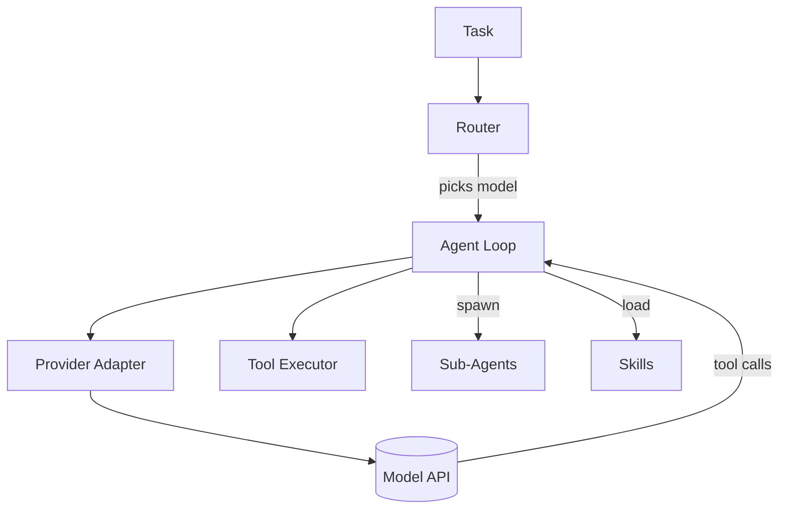

# arccode


[](https://github.com/acnologiaslayer/arccode/actions/workflows/ci.yml)
[](https://github.com/acnologiaslayer/arccode/actions/workflows/release.yml)
[](https://pypi.org/project/arccode/)
[](https://www.python.org/)
[](LICENSE)

**Website: https://acnologiaslayer.github.io/arccode/** (also at http://arcma.dev/arccode/)

A multi-provider agent harness, as a CLI. arccode routes each task to the right
model based on **complexity, cost, performance, and intent**, and can **spawn
specialist agents, load/import skills, and build new agents and skills** at
runtime.

Inspired by the architectures of Claude Code (file-based agents + skills),
jcode (model routing + swarm), and openclaw (clean provider/tool abstraction).



## Features

- **Multi-provider**: Anthropic, OpenAI, Ollama (local), OpenRouter behind one
  normalized interface. Models are hot-swappable.
- **Auth**: static API keys or **OAuth login** (PKCE + device flow) with
  automatic token refresh, like Claude Code / jcode.
- **Smart routing**: heuristic classifier scores each model by capability, cost,
  and latency for the task's intent and complexity. Explicit overrides win.
- **Agents as files**: Markdown + YAML frontmatter, auto-discovered. Each agent
  pins a model policy, tool allowlist, and skills.
- **Skills with progressive disclosure**: `SKILL.md` folders; descriptions are
  always indexed, bodies load on demand.
- **Orchestration**: coordinator spawns specialists and fans out subtasks.
- **Full toolset**: read/write/edit/multiedit, ls/glob/grep, bash (+background),
  web fetch/search, todo, memory, MCP tools, and meta-tools that build agents
  and skills.
- **MCP client**: connect stdio MCP servers; their tools appear as
  `mcp__<server>__<tool>`.
- **Hooks + slash commands**: PreToolUse/PostToolUse shell hooks; `/command`
  prompt templates.

## Install

From PyPI (recommended):

```bash
pipx install arccode      # isolated global CLI
pip install arccode       # into the current environment
```

Or one-line install (auto-detects pipx, else an isolated venv):

```bash
curl -fsSL https://acnologiaslayer.github.io/arccode/install.sh | sh
```

Bleeding edge, straight from the repo:

```bash
pipx install git+https://github.com/acnologiaslayer/arccode
```

Uninstall:

```bash
pipx uninstall arccode
# or, if installed via the script:
curl -fsSL https://acnologiaslayer.github.io/arccode/uninstall.sh | sh
```

From a clone (for development):

```bash
git clone https://github.com/acnologiaslayer/arccode && cd arccode
pip install -e .                 # provider SDKs (anthropic, openai) included
pip install -e '.[dev]'          # + pytest/ruff for development
```

> **Releasing:** tagging `v*` runs `.github/workflows/release.yml`, which builds
> the wheel/sdist, publishes to PyPI via trusted publishing, and attaches the
> artifacts to a GitHub Release. PyPI trusted publishing is configured for
> `acnologiaslayer/arccode` (workflow `release.yml`, environment `pypi`).

Set the keys for whatever providers you use:

## Authentication

arccode accepts two credential types per provider, checked in this order:

1. **API key** (env var, always wins): `ANTHROPIC_API_KEY`, `OPENAI_API_KEY`,
   `OPENROUTER_API_KEY`. Ollama runs locally at `:11434` with no key.
2. **OAuth login** (subscription-style, like Claude Code / jcode):

```bash
arccode auth login openai          # opens a browser, PKCE + local callback
arccode auth login anthropic
arccode auth login github --device # headless / SSH: device-code flow
arccode auth status                # show which providers are logged in
arccode auth logout openai
```

Tokens are stored in `~/.arccode/credentials.json` (mode 0600) and are
**refreshed automatically** when they expire. OAuth clients are issued by each
provider, so set your `client_id` (and any endpoint overrides) in
`~/.arccode/oauth.json`:

```json
{
  "providers": {
    "openai": {
      "auth_url": "https://auth.openai.com/authorize",
      "token_url": "https://auth.openai.com/oauth/token",
      "client_id": "YOUR_CLIENT_ID",
      "scopes": ["openid", "profile", "offline_access"]
    }
  }
}
```

Supported flows: **Authorization Code + PKCE** (RFC 7636) with a loopback
callback, and the **Device Authorization Grant** (RFC 8628) for headless use.

## Usage

```bash
arccode run "Add a --json flag to the export command and test it"
arccode run "Design a rate limiter for 10k rps" --agent architect -v
arccode run "Summarize every file in src/" --agent researcher
arccode chat                       # interactive REPL
arccode spawn debugger "pytest fails in test_auth" -v

arccode agents                     # list agents
arccode skills                     # list skills
arccode models                     # model catalog + pricing
arccode whichmodel "refactor the distributed cache layer"   # explain routing
arccode mcp                        # list connected MCP servers
```

Force a model, auto-approve tools, run non-interactively:

```bash
arccode run "fix the failing build" -m workhorse -y
```

Resumable sessions (history persists to `~/.arccode/sessions/<id>.json`):

```bash
arccode run "Start reviewing the auth module" -s new     # prints a session id
arccode run "Now check the token refresh path" -s 20260809-...   # resumes
arccode sessions                                          # list saved sessions
```

## Configuration

- **Models**: edit `src/arccode/config.py`, or point `ARCCODE_CONFIG` at a YAML
  file with a `models:` map to add/override entries.
- **Agents**: drop a `.md` file in `src/arccode/agents/registry/` (or set
  `ARCCODE_AGENTS_DIR`). Format:

  ```markdown
  ---
  name: my-agent
  description: When to use this agent.
  model: workhorse        # catalog key, full id, or "auto"
  effort: medium
  tools: [read_file, write_file, bash, grep]
  skills: [git-commit]
  ---
  System prompt body...
  ```

- **Skills**: create `skills/registry/<name>/SKILL.md` with `name` +
  `description` frontmatter and a body. Import external skills with the
  `import_skill` tool.
- **MCP**: `~/.arccode/mcp.json`:

  ```json
  { "servers": { "fs": { "command": ["npx", "-y", "@modelcontextprotocol/server-filesystem", "."] } } }
  ```

- **Hooks**: `~/.arccode/hooks.json` or `./.arccode/hooks.json`:

  ```json
  { "PreToolUse": [{ "match": "bash", "command": "grep -q 'rm -rf' && exit 2 || exit 0" }] }
  ```

- **Slash commands**: `./.arccode/commands/<name>.md`; body is a prompt template
  with `$ARGUMENTS`.

## Routing policy

| Intent | Model tier | Rationale |
|---|---|---|
| bulk read / summarize | small / cheap | high volume, low stakes |
| implement | mid workhorse | good tools + code, moderate cost |
| design / debug / review | frontier | needs strong reasoning |
| chat | small | latency matters |

Complexity nudges the choice up a tier; explicit `--model` always wins.

## Architecture

```
src/arccode/
  config.py          model catalog + pricing + weights
  router.py          intent/complexity -> model
  providers/         base + anthropic + openai_compat (openai/ollama/openrouter)
  tools/             fs, shell, web, productivity, meta + registry
  agents/            loader + runtime loop + registry/*.md
  skills/            SkillRegistry + registry/<name>/SKILL.md
  orchestrator.py    spawn / fan-out
  mcp.py             stdio MCP client
  hooks.py           hooks + slash commands
  app.py             assembly
  cli.py             typer CLI
```

## Testing

```bash
pip install '.[dev]' && pytest -q
```

The suite includes real-path integration tests: a scripted fake provider drives
the **actual** agent loop, tool execution (files written/read on disk), the
orchestrator `spawn` path (a sub-agent really runs and writes a file), hook
blocking (a `PreToolUse` hook prevents a side effect), and graceful handling of
provider errors. Only the LLM HTTP call is substituted; everything else is real.

CI (`.github/workflows/ci.yml`) additionally verifies that a bare `pip install .`
bundles the provider SDKs and that the CLI runs, across Python 3.10-3.12.

## Scope vs jcode / Claude Code

arccode implements the core harness architecture those tools share, not their
full surface. **Present:** multi-provider routing, file-based agents + skills,
spawn/orchestration, the tool suite above, an MCP stdio client, hooks,
slash commands, and persistent resumable sessions. **Not yet:** response
streaming, a browser tool, sandboxed execution, tiered permission policies,
background-task supervision, and an LLM-based (vs heuristic) router.
Contributions welcome.

## Branding

The arccode mark is a **routing hub** that fans out along an **arc** to three
model-tier nodes, the visual of "route one task to the right model", rendered in
the node-mesh style of the author's emblem. Theme is **red on black**.

| Asset | File |
|---|---|
| Emblem | [`docs/logo.svg`](docs/logo.svg) |
| Wordmark | [`docs/logo-wordmark.svg`](docs/logo-wordmark.svg) |
| Monochrome | [`docs/logo-mono.svg`](docs/logo-mono.svg) |
| Favicon | [`docs/favicon.svg`](docs/favicon.svg) |
| Theme tokens | [`docs/theme.css`](docs/theme.css) |

Palette: `#FF5A5A` → `#E5121B` → `#7A0A0A` (accent node `#FF8A8A`) on
black surfaces (`#060606` / `#141010`).

## License

MIT