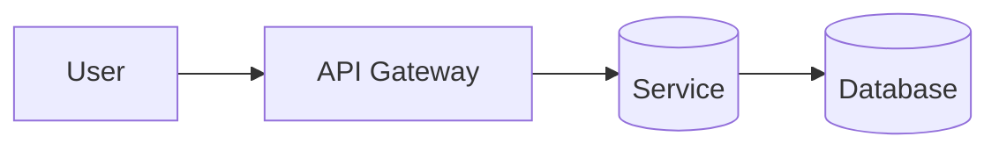

# Mermaid Diagrams

When asked to visualize a system or flow, emit a fenced ```mermaid block.

Pick the type:
- `flowchart TB|LR` for architecture and process flow
- `sequenceDiagram` for request/response interactions
- `erDiagram` for data models
- `stateDiagram-v2` for state machines

Rules:
- Keep node ids short and alphanumeric; put labels in brackets.
- Prefer TB for tall systems, LR for pipelines.
- Validate mentally that every arrow connects declared nodes.

Example:

